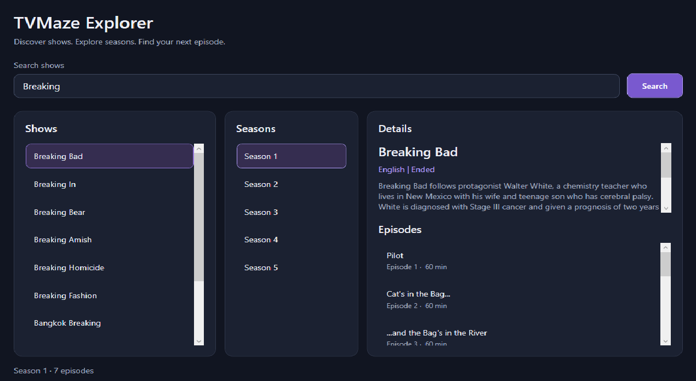

# TVMaze Explorer

TVMaze Explorer is a desktop application for searching TV shows and browsing their seasons and episodes using the TVMaze API. The project started as a university OOP assignment and was later improved with a redesigned interface and additional functionality.

## Main features

- Search for TV shows by name.
- View show details and descriptions.
- Browse seasons and episodes, including episode runtimes.
- See loading messages, empty states, and helpful error messages.

- 

## Technologies used

C#, WPF, XAML, .NET 7, and the TVMaze API.

## How to run

1. On Windows, install Visual Studio 2022 with the **.NET desktop development** workload and the .NET 7 SDK.
2. Download or clone this repository.
3. Open `OOP_DZ5.sln` in Visual Studio and let it restore the NuGet packages.
4. Press **F5** to run the app. You need an internet connection to load TVMaze data.
